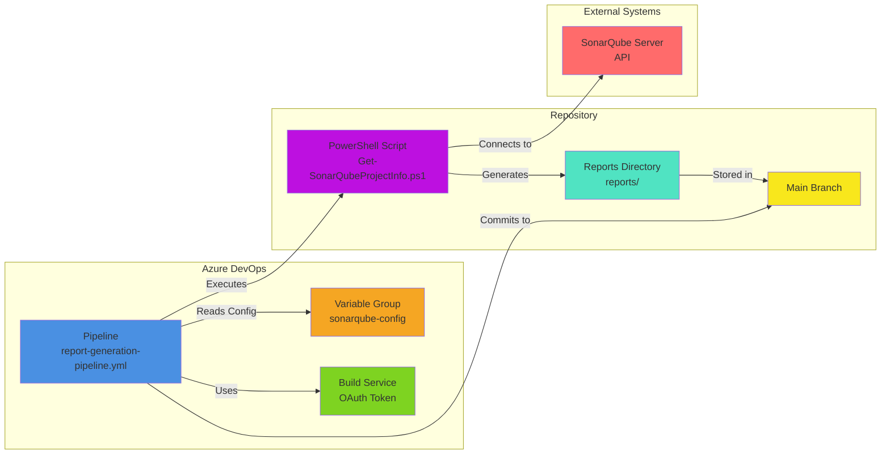
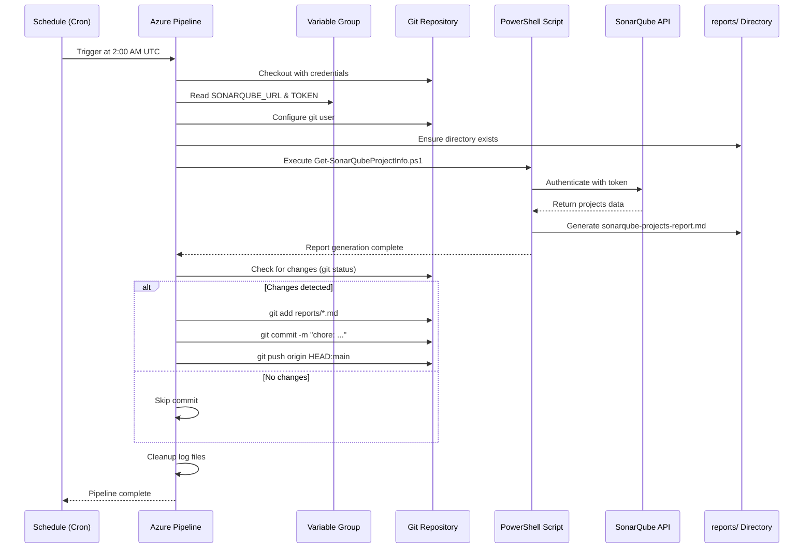
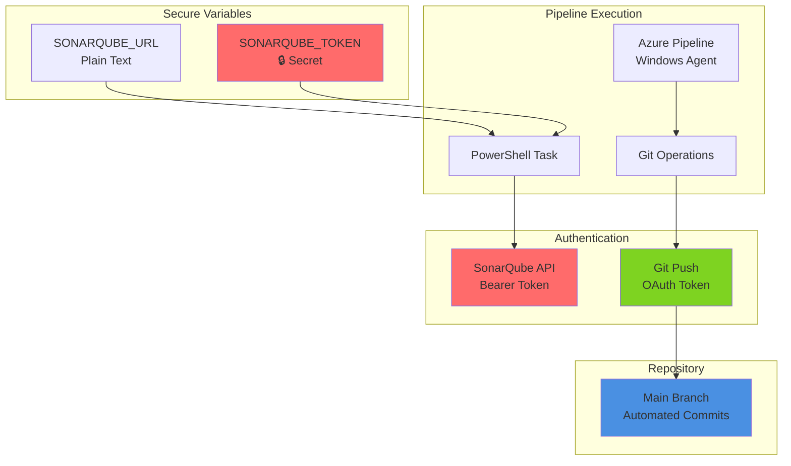
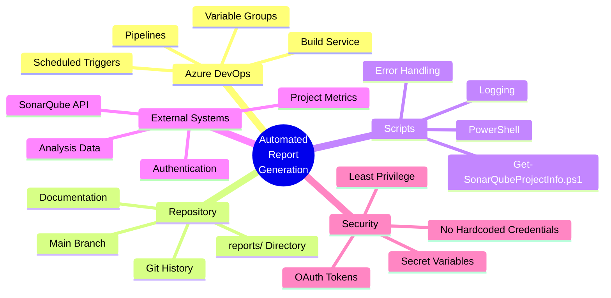
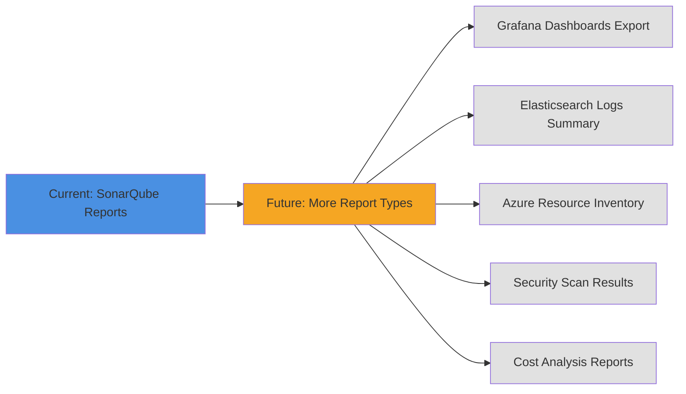

# Automated Report Generation - Architecture Diagram

## Pipeline Flow

```mermaid
graph TD
    A[Scheduled Trigger<br/>Daily 2:00 AM UTC] --> B[Checkout Repository<br/>with Credentials]
    B --> C[Configure Git User<br/>azure-pipeline@devops.com]
    C --> D[Create/Verify<br/>reports/ Directory]
    D --> E[Execute PowerShell Script<br/>Get-SonarQubeProjectInfo.ps1]
    E --> F{Script<br/>Successful?}
    F -->|Yes| G[Report Generated]
    F -->|No| H[Continue with Warning]
    G --> I{Changes<br/>Detected?}
    H --> I
    I -->|Yes| J[Add Reports to Git]
    I -->|No| K[Skip Commit]
    J --> L[Commit with Timestamp<br/>+ [skip ci] Tag]
    L --> M[Push to Main Branch]
    M --> N[Cleanup Log Files]
    K --> N
    N --> O[Pipeline Complete]
    
    style A fill:#e1f5ff
    style E fill:#fff4e1
    style M fill:#e1ffe1
    style O fill:#f0f0f0
```

## Component Architecture



## Data Flow



## Directory Structure After Pipeline Execution

```
devops/
├── .github/
├── applications/
├── configs/
├── docs/
│   ├── report-generation-setup.md          # Complete setup guide
│   ├── report-generation-quickstart.md     # Quick reference
│   └── IMPLEMENTATION_SUMMARY.md           # Implementation details
├── examples/
├── infrastructure/
├── monitoring/
├── pipelines/
│   ├── README.md                            # Updated with pipeline info
│   └── report-generation-pipeline.yml       # ⭐ Main pipeline
├── reports/                                 # ⭐ New directory
│   ├── README.md                            # Reports documentation
│   └── sonarqube-projects-report.md         # ⭐ Auto-generated report
└── scripts/
    └── powershell/
        └── Get-SonarQubeProjectInfo.ps1     # Existing script
```

## Security Model



## Schedule Configuration

```yaml
# Cron Expression: "0 2 * * *"
# Format: minute hour day month weekday

┌───────────── minute (0 - 59)
│ ┌─────────── hour (0 - 23)
│ │ ┌───────── day of month (1 - 31)
│ │ │ ┌─────── month (1 - 12)
│ │ │ │ ┌───── day of week (0 - 6) (Sunday=0)
│ │ │ │ │
0 2 * * *  →  Daily at 2:00 AM UTC

Common Patterns:
- "0 2 * * *"     → Daily at 2:00 AM
- "0 */6 * * *"   → Every 6 hours
- "0 8 * * 1"     → Every Monday at 8:00 AM
- "0 0 1 * *"     → First day of month
- "0 9-17 * * 1-5" → Weekdays 9 AM to 5 PM (hourly)
```

## Commit Message Pattern

```
chore: automated report generation - YYYY-MM-DD HH:mm:ss [skip ci]
                                     └─────┬─────┘         └───┬───┘
                                          Timestamp        Prevents
                                                          CI trigger
Example:
chore: automated report generation - 2025-11-12 02:00:15 [skip ci]
```

## Integration Points



## Extensibility



---

## Legend

- 🔒 = Secret/Encrypted
- ⭐ = New/Modified by pipeline
- ✅ = Completed/Verified
- 📘 = Documentation
- 🔄 = Automated Process

## Notes

1. **Pipeline runs independently** - No manual intervention needed
2. **Version controlled reports** - Full history in git
3. **Secure by design** - No credentials in code
4. **Extensible architecture** - Easy to add more reports
5. **Skip CI tag** - Prevents infinite pipeline loops

---
*Diagrams generated with Mermaid syntax*
*For best viewing, use a Markdown viewer with Mermaid support*
